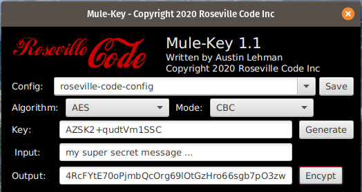

# Mule-Key 1.0

Application providing mule crypto functions. The main purpose of this tool is to 
assist with property encryption. This can be used instead of the Secure Properties 
Tool Jar CLI application. Written in Java 14 and JavaFX. Native installers are built 
for Linux, MacOS, and even Winders. Licensed under the GNU GPL v3, so use away.



## Building
You can build from source with maven.

**Requiremets**
- [Java 14](https://adoptopenjdk.net/)
- [JavaFX SDK](https://gluonhq.com/products/javafx/)
- [Maven](https://maven.apache.org/download.cgi)

```
> mvn clean package
and then to run
> java --module-path $PATH_TO_FX --add-modules javafx.controls,javafx.fxml -jar target/mule-key-1.0.jar
Where PATH_TO_FX is the lib directory where you put the JavaFX SDK.
(example: /opt/javafx/javafx-sdk-14.0.1/lib)
```

## Buiding Native Installers
An install is much easier to work with and allows you to easily distribute an 
application. There are package scripts in the root repository directory for Linux (deb), 
MacOS (dmg), and Windows (exe). The build process only works from the respective platform 
though. This means that you can't cross compile say a Windows exe from a Linux 
workstation. 

For all 3 platforms, you will need the following requirements.
- [AdoptOpenJDK Version jdk-14.0.1+7](https://adoptopenjdk.net/)
- [JavaFX SDK 14.0.1](https://gluonhq.com/products/javafx/)
- [JavaFX JMods 14.0.1](https://gluonhq.com/products/javafx/)
- [Maven](https://maven.apache.org/download.cgi)

You will need to set the following environment variables for the build script. On 
MacOS and Linux you can likely set these in /.profile and on Windows you need to 
set them as environment variables.
- JAVA_HOME needs to point to the root directory of your Java JDK.
(example: /usr/lib/jvm/jdk-14.0.1+7)
- PATH_TO_FX need to point to the lib directory in the JavaFX SDK you downloaded.
(example: /opt/javafx/javafx-sdk-14.0.1/lib)
- PATH_TO_FX_MODS needs to point to the root directory of the JavaFX JMods directory 
you downloaded. (example: /opt/javafx/javafx-jmods-14.0.1)

### Linux Requirements
There are no extra requirements that I'm aware of. One thing to note, make sure to 
use a manual install of AdoptOpenJDK from the provided link and not any of the 
openjdk options from the package manager. There's a known bug that breaks the 
jpackage support. 
[Ubuntu Jlink Bug for Reference](https://bugs.launchpad.net/ubuntu/+source/openjdk-14/+bug/1868699)

### MacOS
- You will need XCode installed.

### Windows
- You will need a recent version of Windows, the build was tested on Windows 10.
- [Microsoft .NET Framework 3.5 Service Pack 1 ](https://www.microsoft.com/en-us/download/details.aspx?id=22)
- [Wix Toolset](https://wixtoolset.org/)
- [Git Bash for Windows](https://gitforwindows.org/) You need to install all the 
available unix tools in the installation.

**Note:** The build script has to be run from Git bash, running from the Windows 
command prompt won't work. Although it's building on a Windows machine the build 
script is expecting a bash shell environment.

### 

#### Running The Installer Build Script
Once you've setup the build requirements for the specific platform then you 
can run the package script for your platform.
```
Debian/Ubuntu/PopOS
> ./package-deb.sh
MacOS
> ./package-dmb.sh
Winders (from git-bash)
> ./package-exe.sh
```

## License

This file is part of the Mule-Key (https://github.com/rsv-code/mule-key).
Copyright (c) 2020 Roseville Code Inc

This program is free software: you can redistribute it and/or modify
it under the terms of the GNU General Public License as published by
the Free Software Foundation, version 3.

This program is distributed in the hope that it will be useful, but
WITHOUT ANY WARRANTY; without even the implied warranty of
MERCHANTABILITY or FITNESS FOR A PARTICULAR PURPOSE. See the GNU
General Public License for more details.

You should have received a copy of the GNU General Public License
along with this program. If not, see <http://www.gnu.org/licenses/>.
